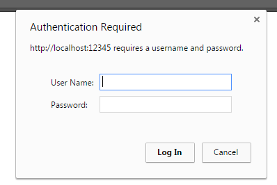
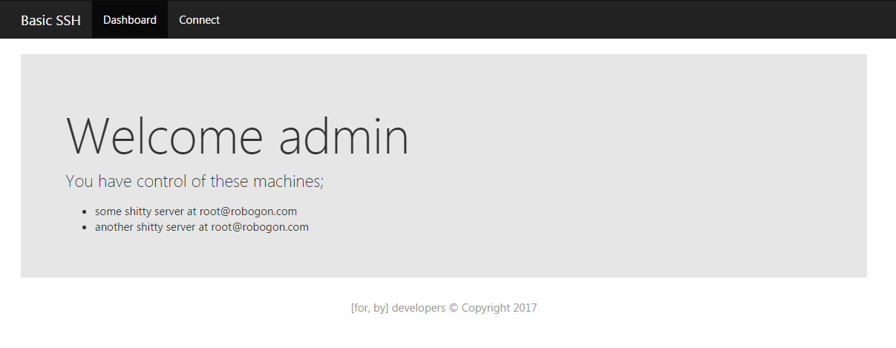
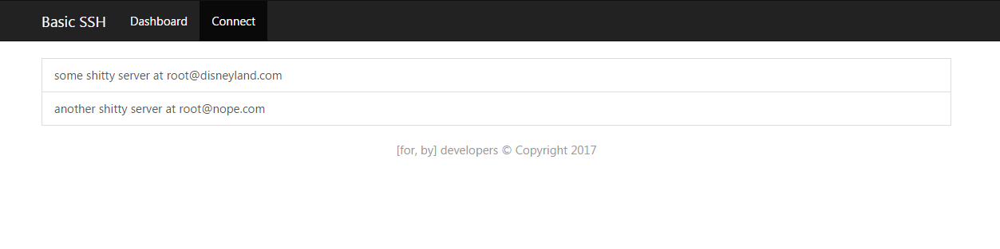
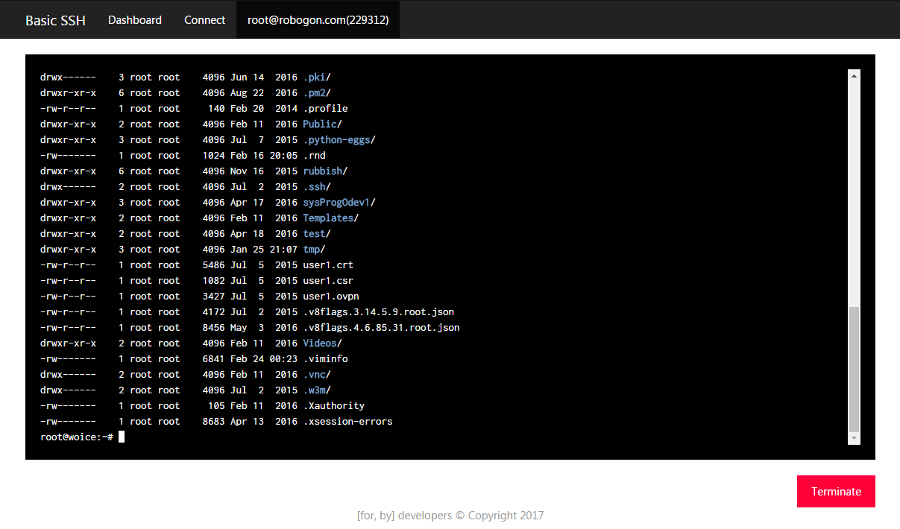
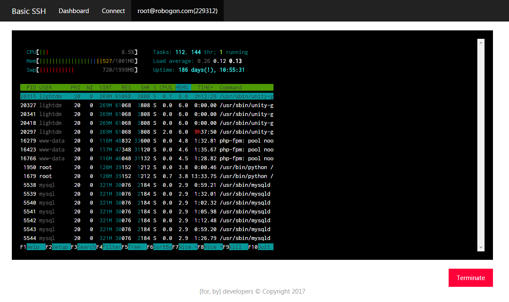

Basic-SSH
===================
This tool is for proxy-secured location. Many companies has own connection rules for internet. Unfortunately some of them blocks SSH port.
Some of them blocks rpc, websocket etc. (What a douchebag!)

With this tool you will use ssh with basic request based communication.

> **Note:** I writed project with sse first. but http proxy blocked it too. I rewrite all sse segments to basic restful services. Same reason I didn't use ws, rpc.. It may be laggy but It will work.

Images first
----------------------

Connect the configured domain (or ip:12345). Basic authentication will be shown. Login with user name and password.



Click Connect



Pick a server



Type :)







Installation
------------------

Very complicated!

```
git clone http://github.com/co3moz/basic-ssh
cd basic-ssh
npm i
```

Edit config file in config directory. Example config;

```json
{
  "port": 12345,
  "speed": 1000,
  "users": [
    {
      "login": "admin",
      "password": "123456789"
    }, {
      "login": "another_admin",
      "password": "123456789"
    }
  ],

  "servers": [
    {
      "name": "My local server",
      "ip": "localhost",
      "port": "22",
      "login": "root",
      "password": "your password",
      "responsible": [
        "admin"
      ]
    }
  ]
}
```

You can use pm2 to start application

```
pm2 start app.js --name="BasicSSH"
```

Configure nginx

```
server {
    listen *:80;

    server_name <DOMAIN>;

    root /srv/<PROJECT ROOT>;
    index index.html index.htm index.php;

    location  / {
        proxy_pass http://localhost:12345;
        proxy_set_header Host $http_host;
        proxy_set_header X-Real-IP $remote_addr;
        proxy_set_header X-Forwarded-Proto $scheme;
        proxy_set_header X-Forwarded-For $proxy_add_x_forwarded_for;
        proxy_set_header HTTPS $https;
    }
}

```

You are ready to depart :)
